# INFO6205-Project Traveling Salesman Problem

This repository is for INFO 6205 Traveling Salesman Problem.

Based on our analysis and experimentation with various algorithms for the Traveling Salesman Problem, we conclude that the Nearest Neighbor, Greedy Heuristic, and Christofides Algorithm are effective methods for generating optimized tours.

However, after incorporating additional optimization techniques such as Ant Colony Optimization, 2-opt, 3-opt, and Simulated Annealing, we observed that the overall performance of these algorithms improved significantly. The combination of Christofides Algorithm, Ant Colony Optimization, 2-opt, 3-opt, and Simulated Annealing yielded the best result overall with $608784.54$m with $18.46\%$ ratio ($\frac{distane - MST} {MST}$)

In conclusion, the Traveling Salesman Problem is a complex optimization problem, and it requires careful consideration and experimentation with various algorithms to achieve optimized results. Our analysis and results demonstrate the importance of incorporating multiple strategies and optimization techniques to generate the most effective solution.

---

**_Team member_**:

-   Bochao Zheng
-   Yongyan Deng
-   Yuxi Chen

<a href="https://github.com/DanielZheng916/INFO6205-Project/graphs/contributors">
  
</a>

---

**_Content_**

-   [Introduction](#Introduction)
-   [Algorithm](#Algorithm)
-   [Example](#example--usage)
-   [unit test](docs/unit%20test.md)
-   [Optimization Strategies](#optimization-strategies)
-   [Observations & Graphical Analysis](#graph-operation--algorithm-visualization)
-   [Results & Mathematical Analysis](#results--mathematical-analysis)
-   [Conclusion](#conclusion)

---

# Introduction

## Traveling Salesman Problem

The Traveling Salesman Problem is a classic problem in computer science that involves finding the shortest possible route that visits each city exactly once and returns to the starting city, given a set of cities and their distances. In this project, we aim to explore different methods to solve the problem efficiently.

We assume the distance between each city is symmetric. The distance between city A to city B and city B and city A is the same.

## Approach

To solve the Traveling Salesman Problem efficiently, we used various heuristic algorithms such as Nearest Neighbor, Greedy Heuristic, and Christofides algorithm to generate solutions within a reasonable time frame. We further optimized the solution by applying algorithms like 2-opt, 3-opt, Ant colony optimization, Simulated annealing, and Random swapping to obtain the most optimal solution.

# Algorithm

## MST

Given a connected, undirected graph, a spanning tree is a subgraph that includes all the vertices of the original graph but contains no cycles. A minimum spanning tree is a spanning tree that has the minimum possible weight among all possible spanning trees. The weight of a spanning tree is the sum of the weights of its edges.

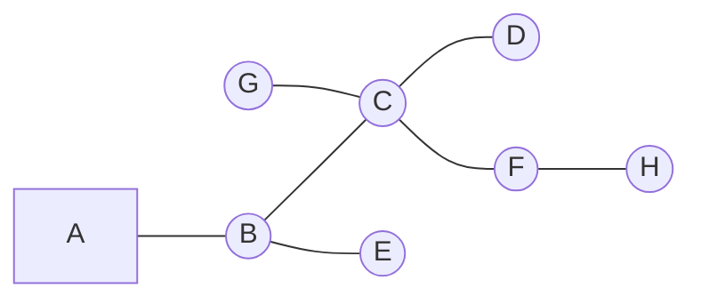

While MST is commonly used as a lower bound for the Traveling Salesman Problem (TSP), it is not the optimal lower bound. The maximum 1-tree of the graph provides a better lower bound, resulting in the algorithm's performance in the report being potentially slightly lower than the theoretical value.

## Generating Algorithms

### Nearest neighbor [^1]

[TSPNearestNeighbor.java](src/main/java/com/info6205/team01/TSP/tactical/TSPNearestNeighbor.java)

#### Overview

The salesman starts at a random city. Each time, it chooses the nearest city as the next visit until all cities have been visited.

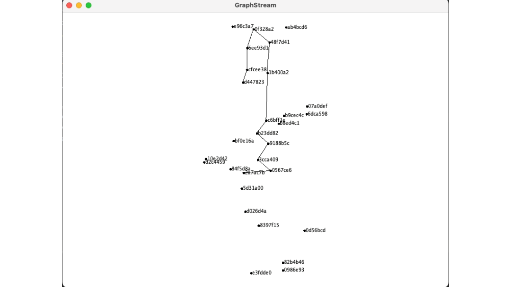

### Greedy Heuristic [^2]

[GreedyHeuristic.java](src/main/java/com/info6205/team01/TSP/tactical/GreedyHeuristic.java)

#### Overview

Each time, add the shortest edge into the route if

-   there is no cycle after adding this edge
-   the edges connected to the city should be less or equal to 2 (Degree $\le$ 2)

Reapt adding edge into route until every city is visited.

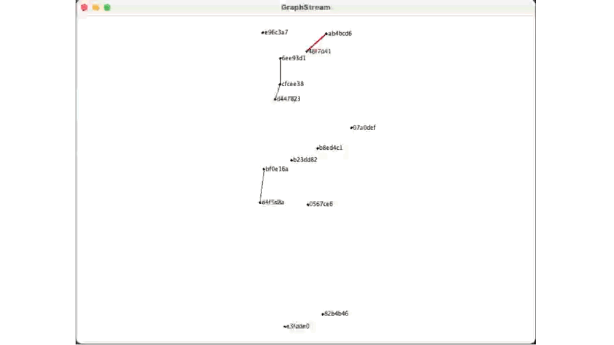

### Christofides Algorithm [^3]

[ChristofidesAlgorithm.java](src/main/java/com/info6205/team01/TSP/tactical/ChristofidesAlgorithm.java)

#### Overview

Christofides algorithm is an approximate algorithm for solving the Traveling Salesman Problem (TSP) in a special case where the distances between nodes form a metric space (i.e., they satisfy the triangle inequality). The algorithm guarantees a solution within 1.5 times the optimal solution.

1. Use Prim’s Algorithm to find a minimum spanning tree (MST):

    https://github.com/DanielZheng916/INFO6205-Project/blob/b4cf8cb8bed2d10e5bac3a00f2a587da5b8e9069/src/main/java/com/info6205/team01/TSP/tactical/ChristofidesAlgorithm.java#L72-L73

    https://github.com/DanielZheng916/INFO6205-Project/blob/b4cf8cb8bed2d10e5bac3a00f2a587da5b8e9069/src/main/java/com/info6205/team01/TSP/tactical/ChristofidesAlgorithm.java#L127-L167

2. Identify the vertices with an odd degree in the MST. Create a subgraph with the odd-degree vertices:

    https://github.com/DanielZheng916/INFO6205-Project/blob/b4cf8cb8bed2d10e5bac3a00f2a587da5b8e9069/src/main/java/com/info6205/team01/TSP/tactical/ChristofidesAlgorithm.java#L169-L192

3. Find a minimum-weight perfect matching in the subgraph:

    https://github.com/DanielZheng916/INFO6205-Project/blob/b4cf8cb8bed2d10e5bac3a00f2a587da5b8e9069/src/main/java/com/info6205/team01/TSP/util/MinimumWeightMatch.java#L42-L87

4. Combine the MST and the minimum-weight perfect matching:

    https://github.com/DanielZheng916/INFO6205-Project/blob/b4cf8cb8bed2d10e5bac3a00f2a587da5b8e9069/src/main/java/com/info6205/team01/TSP/tactical/ChristofidesAlgorithm.java#L201-L235

5. Form an Eulerian circuit with Hierholzer's algorithm to find the Eulerian circuit:

    https://github.com/DanielZheng916/INFO6205-Project/blob/b4cf8cb8bed2d10e5bac3a00f2a587da5b8e9069/src/main/java/com/info6205/team01/TSP/tactical/ChristofidesAlgorithm.java#L237-L252

    https://github.com/DanielZheng916/INFO6205-Project/blob/b4cf8cb8bed2d10e5bac3a00f2a587da5b8e9069/src/main/java/com/info6205/team01/TSP/util/EulerianCircuit.java#L33-L59

6. Convert the Eulerian circuit into a Hamiltonian cycle:

    https://github.com/DanielZheng916/INFO6205-Project/blob/bf5177773b4b6d95726bf071182b431818a54b79/src/main/java/com/info6205/team01/TSP/util/HamiltonianCircuit.java#L16-L48

7. Calculate the total cost of the Hamiltonian cycle. Add up the costs of all edges in the Hamiltonian cycle to obtain the total cost:

    https://github.com/DanielZheng916/INFO6205-Project/blob/bf5177773b4b6d95726bf071182b431818a54b79/src/main/java/com/info6205/team01/TSP/util/HamiltonianCircuit.java#L50-L67

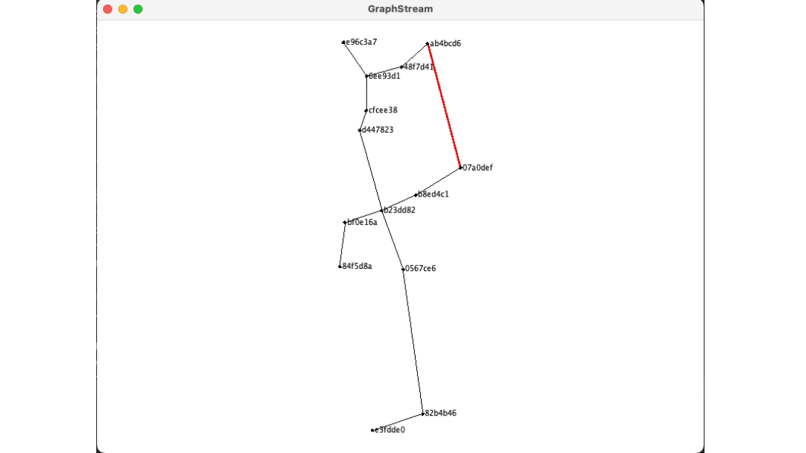

## Optimalzation Algorithms

### Random Swap [^4]

[RandomSwapping.java](src/main/java/com/info6205/team01/TSP/strategic/RandomSwapping.java)

#### Overview

1. Choose two cities at random from the tour
2. Swap their order in the tour
3. Calculate the new tour length
4. If the new tour length is better than the previous one, keep the new tour. Otherwise, discard the new tour and keep the previous

> The initial tour in the animation is based on the Christofides Algorithm

**Part of the whole random swap**

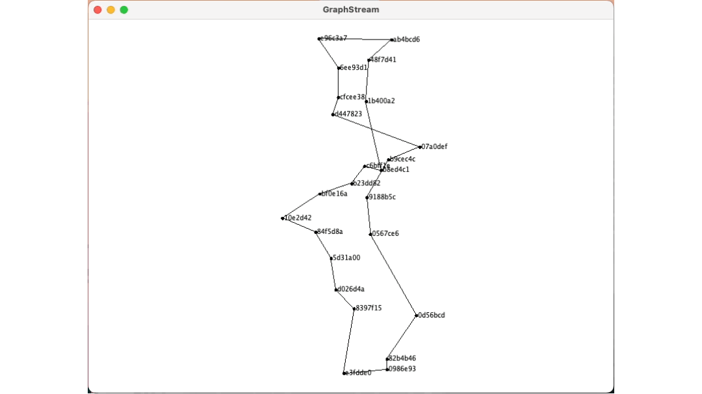

**Random swap only with successful swaps**

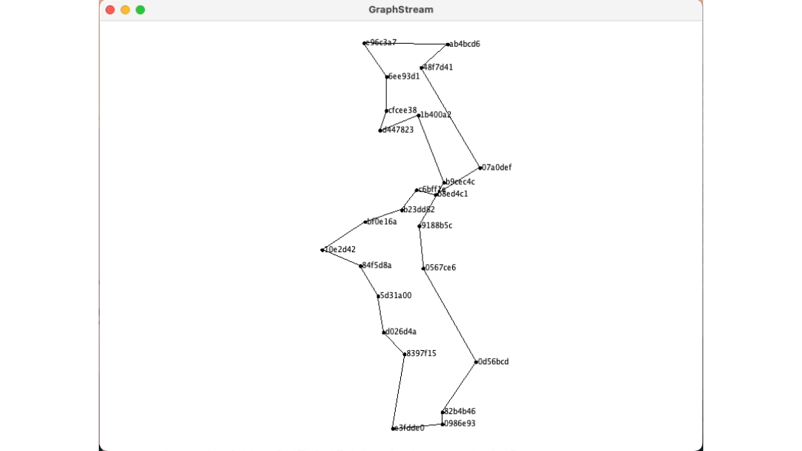

### 2-opt [^4]

[TwoOpt.java](src/main/java/com/info6205/team01/TSP/strategic/TwoOpt.java)

#### Overview

1. Choose two non-adjacent edges in the tour
2. Remove the edges and the two resulting fragments
3. Reconnect the two fragments by choosing a different pair of edges to connect them
4. Calculate the new tour length
5. If the new tour length is better than the previous one, keep the new tour. Otherwise, discard the new tour and keep the previous one.


### 3-opt [^4]

[ThreeOpt.java](src/main/java/com/info6205/team01/TSP/strategic/ThreeOpt.java)

#### Overview

1. Choose three non-adjacent edges in the tour.
2. Remove the edges and the four resulting fragments.
3. Reconnect the fragments by choosing a different set of edges to connect them.
4. Calculate the new tour length.
5. If the new tour length is better than the previous one, keep the new tour. Otherwise, discard the new tour and keep the previous one.

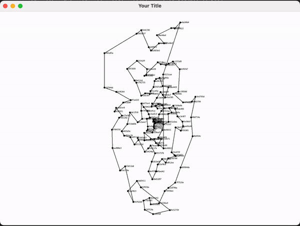

### Ant colony algorithm & optimization [^5]

[AntColonyAlgorithm.java](src/main/java/com/info6205/team01/TSP/tactical/AntColonyAlgorithm.java)

[AntColonyOptimization.java](src/main/java/com/info6205/team01/TSP/tactical/AntColonyOptimization.java)

#### Overview

The Ant Colony Algorithm(AOA) is based on Ant Colony Optimization (ACO) and it was used to solve the Traveling Salesman Problem (TSP) with original graph. The objective is to minimize the total distance travelled. We conduct the AOA and compared the result with Chritofides Algorithm under Ant Colony Optimization. For the convience, we will introduce the ACA, however, you can also check the ACO code [here](src/main/java/com/info6205/team01/TSP/tactical/AntColonyOptimization.java)

_Ant Colony Optimization_

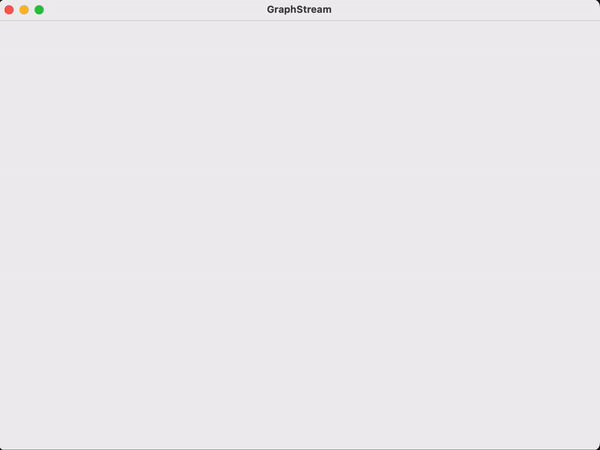

_Ant Colony Algorithm_


1. Initialization: Set the initial pheromone trail value (tau) for all edges between cities. Initialize algorithm parameters, such as the number of ants (m), the number of iterations (t_max), pheromone evaporation rate (evapRate), and the influence of pheromone trail (alpha) and heuristic information (beta).


   https://github.com/DanielZheng916/INFO6205-Project/blob/bf5177773b4b6d95726bf071182b431818a54b79/src/main/java/com/info6205/team01/TSP/tactical/AntColonyAlgorithm.java#L31-L61

   > For ACO, the pheromone matrix initialization is different from ACA. We need to add up the pheromone value of the path in TSP's initial solution(Best Tour from Christofides Algorithm).

   https://github.com/DanielZheng916/INFO6205-Project/blob/bf5177773b4b6d95726bf071182b431818a54b79/src/main/java/com/info6205/team01/TSP/tactical/AntColonyOptimization.java#L54-L56

   https://github.com/DanielZheng916/INFO6205-Project/blob/bf5177773b4b6d95726bf071182b431818a54b79/src/main/java/com/info6205/team01/TSP/tactical/AntColonyOptimization.java#L86-L101


2. For each iteration t = 1 to t_max:

    - Deploy the ants randomly across the cities. For each ant, construct a solution (tour) by visiting cities in the following manner:

    - Select the next city to visit based on a probability that depends on the pheromone trail (tau) and the heuristic information (e.g., inverse of the distance between cities).
    - Update the tabu list (list of visited cities) for the current ant.

    - Repeat until all cities have been visited and the ant returns to the starting city.

    - Evaluate the tours constructed by the ants by calculating their total distances.

    - Update the pheromone trails:

    - Evaporate a portion of the pheromone on all edges by multiplying the current pheromone value by (1 - evaporate rate).

    - Deposit pheromone on the edges that are part of the tours, proportional to the quality of the tour (1 / tour distance). Update the pheromone value of each edge with the new value.

    - Keep track of the best tour found so far (the global best).

        https://github.com/DanielZheng916/INFO6205-Project/blob/bf5177773b4b6d95726bf071182b431818a54b79/src/main/java/com/info6205/team01/TSP/tactical/AntColonyAlgorithm.java#L98-L155

3. The algorithm stops when the maximum number of iterations (t_max) is reached or another stopping criterion is met (e.g., a certain level of convergence is achieved or a time limit is reached).

### Simulated annealing [^6]

[SimulatedAnnealing.java](src/main/java/com/info6205/team01/TSP/tactical/SimulatedAnnealing.java)

#### Overview

In this specific problem, the 2-Opt algorithm is used to generate new solutions; however, the simulated annealing algorithm has an advantage over 2-Opt in that it can tolerate longer paths and escape from local optima. The crucial factor for achieving good results through the simulated annealing algorithm is the parameter setting of temperature and cooling factor. By setting the temperature to 10000 and the cooling factor to 0.999999, the best solution can be obtained.

| temperature = 1000 |      |      |       |        |         |          |           |
| ------------------ | ---- | ---- | ----- | ------ | ------- | -------- | --------- |
| coolingFactor      | 0.9  | 0.99 | 0.999 | 0.9999 | 0.99999 | 0.999999 | 0.9999999 |
| optCount           | 0    | 0    | 0     | 0      | 0       | 132      | Timeout   |

| coolingFactor = 0.999999 |      |      |      |       |        |
| ------------------------ | ---- | ---- | ---- | ----- | ------ |
| temperature              | 10   | 100  | 1000 | 10000 | 100000 |
| optCount                 | 0    | 64   | 176  | 198   | 172    |

1. Initialization: Choose an initial solution to the optimization problem.
2. Perturbation: Generate a new solution by randomly modifying the current solution. The new solution may be worse or better than the current solution.
3. Evaluation: Calculate the objective function value of the new solution.
4. Acceptance: Decide whether to accept the new solution based on a probabilistic criterion. If the new solution is better than the current solution, accept it. If the new solution is worse than the current solution, accept it with a probability that decreases as the temperature decreases.
5. Cooling schedule: Decrease the temperature according to a cooling schedule that gradually reduces the probability of accepting worse solutions over time.
6. Stopping criterion: Repeat steps 2-5 until a stopping criterion is met, such as reaching a maximum number of iterations or a minimum temperature.


# Example & Usage

## TSPSolver

 [TSPSolver.java](src/main/java/com/info6205/team01/TSP/TSPSolver.java) 

This class contains all our algorithms and parts visualization methods. You can run this file to get the results.

To get the algorithm animation, check the [Graph Operation & Algorithm Visualization](#Graph-Operation--Algorithm-Visualization) section.

## Node & Edge

[Node.java](src/main/java/com/info6205/team01/TSP/Graph/Node.java)

[UndirectedEdge.java](src/main/java/com/info6205/team01/TSP/Graph/UndirectedEdge.java)

[DirectedEdge.java](src/main/java/com/info6205/team01/TSP/Graph/DirectedEdge.java)

For representation of points on the graph, we utilize a Node data structure which comprises important attributes such as the node ID, longitude, latitude, and degree, defined as follows:

```java
public class Node {
    private String id;
    private double longitude;
    private double latitude;
    private int degree = 0;
}
```

UndirectedEdge is utilized for representing undirected edges in the graph, and its structure is defined as follows:

```java
public class UndirectedEdge {
    private Node node1;
    private Node node2;
    private double weight;
}
```

The edges are represented by two nodes and the distance between them.

## Load Data

[LoadDataImpl.java](src/main/java/com/info6205/team01/TSP/util/LoadDataImpl.java)

We incorporate a standardized LoadData method for reading and processing data, making it accessible for several algorithms. Its data structure includes essential elements like data length, Node List, distance matrix, and ID-index mapping, maximizing compatibility with various algorithms and graphical tools. The LoadData data structure is defined as follows:

```java
public abstract class LoadData {
    public String path;
    public int length;
    public String[][] metaData;
    public ArrayList<Node> nodes = new ArrayList<>();
    public double[][] coordination;
    public double[][] adjacencyMatrix;
    public String[] indexToID;
    public Map<String, Integer> IDToIndex = new HashMap<>();
}
```

```java
// Default file:
// src/main/java/com/info6205/team01/TSP/resources/info6205.spring2023.teamproject.csv
LoadDataImpl ld = new LoadDataImpl();
LoadDataImpl ld2 = new LoadDataImpl("Path/to/file")
```

Get Nodes ( [Node.java](src/main/java/com/info6205/team01/TSP/Graph/Node.java) )

```java
LoadDataImpl ld = new LoadDataImpl();
List<Node> nodes = ld.nodes;
```

## Graph Operation & Algorithm Visualization

[GraphOperation.java](src/main/java/com/info6205/team01/TSP/visualization/GraphOperation.java)

[AlgorithmVisualization.java](src/main/java/com/info6205/team01/TSP/visualization/AlgorithmVisualization.java)

To get the animations of the graph, you need to pass the graph operation list into algorithm visualization.

```java
// Example Usage
LoadDataImpl ld = new LoadDataImpl();

// Run your algorithm
GreedyHeuristic gh = new GreedyHeuristic(ld.nodes);

// Get gos
gh.getGos();

// Build av
AlgorithmVisualization av = new AlgorithmVisualization(ld.nodes, gh.getGos());

// You can set sleep time
// default: 500
av.setSleepTime(50);

// Show the animation
av.showResult();
```

## Nearest Neighbor

[TSPNearestNeighbor.java](src/main/java/com/info6205/team01/TSP/tactical/TSPNearestNeighbor.java)

```java
TSPNearestNeighbor tspNearestNeighbor = new TSPNearestNeighbor(new LoadDataImpl());
tspNearestNeighbor.findShortestPath();

// Get gos
List<GraphOperation> gos = tspNearestNeighbor.getGos();

// Get tour distance
int minDis = tspNearestNeighbor.getMinDistance();
```

## Greedy Heuristic

[GreedyHeuristic.java](src/main/java/com/info6205/team01/TSP/tactical/GreedyHeuristic.java)

```java
// Example Usage
LoadDataImpl ld = new LoadDataImpl();

// Run your algorithm
GreedyHeuristic gh = new GreedyHeuristic(ld.nodes);

// Get gos
List<GraphOperation> gos = gh.getGos();

// Get tour distance
int minDis = gh.getMinDistance();
```

## Christofides Algorithm

[ChristofidesAlgorithm.java](src/main/java/com/info6205/team01/TSP/tactical/ChristofidesAlgorithm.java)

```java
LoadDataImpl ld = new LoadDataImpl();

ChristofidesAlgorithm ca = new ChristofidesAlgorithm(ld.nodes);
ca.setGenerateGos(true); // Set true if you want to get Gos
ca.run();

// Get tour
List<Node> tour = ca.getHamiltonianCircuit();

// Get gos
List<GraphOperation> gos = ca.getGos();

// Get tour distance
int minDis = ca.getMinDistance();
```

## Random Swap

[RandomSwapping.java](src/main/java/com/info6205/team01/TSP/strategic/RandomSwapping.java)

```java
LoadDataImpl ld = new LoadDataImpl();

ChristofidesAlgorithm ca = new ChristofidesAlgorithm(ld.nodes);
ca.setGenerateGos(true); // Set true if you want to get Gos
ca.run();

List<Node> tour = ca.getHamiltonianCircuit();

RandomSwapping rs = new RandomSwapping(tour);

// Get Gos
List<GraphOperation> gosWhenSwapSuccess = rs.getGos(true); // Gos
List<GraphOperation> gosForEverySwap = rs.getGos();

// Get Mindistance
int minDis = rs.getMinDistance();
```

## 2-opt

[TwoOpt.java](src/main/java/com/info6205/team01/TSP/strategic/TwoOpt.java)

```java
LoadDataImpl ld = new LoadDataImpl();

ChristofidesAlgorithm ca = new ChristofidesAlgorithm(ld.nodes);
ca.setGenerateGos(true); // Set true if you want to get Gos
ca.run();

List<Node> tour = ca.getHamiltonianCircuit();

RandomSwapping rs = new RandomSwapping(tour);

// Get Gos
List<GraphOperation> gosWhenSwapSuccess = rs.getGos(true); // Gos
List<GraphOperation> gosForEverySwap = rs.getGos();

// Get Mindistance
int minDis = rs.getMinDistance();
```

## 3-opt

[ThreeOpt.java](src/main/java/com/info6205/team01/TSP/strategic/ThreeOpt.java)

```java
private ThreeOpt optimizeWithThreeOpt(List<Node> tour, LoadDataImpl ld) {
    ThreeOpt threeOpt = new ThreeOpt(tour, ld);
    threeOpt.optimize();
    return threeOpt;
}
```

## Ant Colony Algorithm & Optimization

[AntColonyAlgorithm.java](src/main/java/com/info6205/team01/TSP/tactical/AntColonyAlgorithm.java)

[AntColonyOptimization.java](src/main/java/com/info6205/team01/TSP/tactical/AntColonyOptimization.java)

_ACA example_

```java
// Initialize variables for Ant Colony Algorithm
LoadDataImpl ld = new LoadDataImpl();
AntColonyAlgorithm aca = new AntColonyAlgorithm(ld.nodes, 10, 100, 0.7, 1, 5);

aca.run();
aca.result();

AlgorithmVisualization av = new AlgorithmVisualization(ld.nodes, aca.getGos());
av.setSleepTime(10);
av.showResult();
```

_ACO example_

```java
// ACO Example
public static void main(String[] args) throws Exception {
// Initialize variables for ACO
LoadDataImpl ld = new LoadDataImpl();
ChristofidesAlgorithm ca = new ChristofidesAlgorithm(ld.nodes);
ca.run();
List<Node> christofidesGraph = ca.getTour();
AntColonyOptimization aco = new AntColonyOptimization(ld.nodes, christofidesGraph, 10, 100, 0.7, 1, 5);

aco.run();
aco.result();

AlgorithmVisualization av = new AlgorithmVisualization(ld.nodes, aco.getGos());
av.setSleepTime(10);
av.showResult();
```

## Simulated Annealing

[SimulatedAnnealing.java](src/main/java/com/info6205/team01/TSP/tactical/SimulatedAnnealing.java)

```java
private SimulatedAnnealing optimizeWithSimulatedAnnealing(List<Node> tour, LoadDataImpl ld) {
    SimulatedAnnealing simulatedAnnealing = new SimulatedAnnealing(tour, ld);
    simulatedAnnealing.optimize();
    return simulatedAnnealing;
}
```

# Optimization Strategies

In our project, we utilized a combination of different optimization methods to improve the path generated by the heuristic algorithm. These methods have distinct optimization effects and runtimes.

The Ant colony optimization method increases the hormone level of all edges in the original path before executing the algorithm. However, as the original path has limited influence on the algorithm and contains randomness, the optimized result may sometimes be longer.

The 2-Opt method usually results in noticeable improvements, while the 3-Opt method can further optimize the results based on 2-Opt. Both 2-Opt and 3-Opt guarantee that the optimization result is not worse than the original result.

Simulated annealing has a unique feature that generates new paths that differ significantly from the original path. This method also ensures that the optimization result is not worse than the original.

Our experiments demonstrated that combining these various optimization methods can result in superior outcomes. Specifically, through the use of Ant colony optimization, 2-Opt, 3-Opt, and simulated annealing, we can achieve the best results.

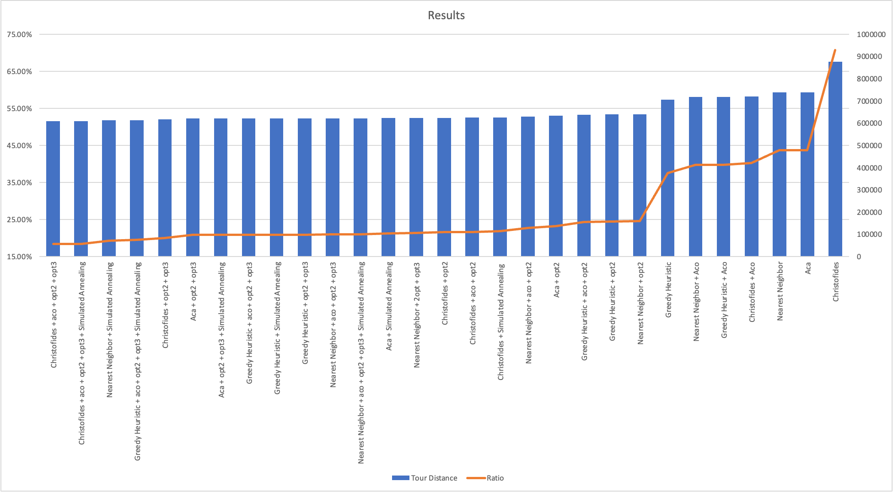

# Observations & Graphical Analysis

## Result

The method utilized a combination of various algorithms including Christofides, Ant Colony Optimization, 2-Opt, 3-Opt, and Simulated Annealing to produce the optimal result. We began by creating a base tour with the Christofides algorithm which was then used as a foundation for Ant colony optimization to generate an even better tour. Next, we utilized 2-Opt and 3-Opt searching algorithms to find the optimal tour. Finally, we applied Simulated Annealing to assist in breaking out of any local optimal solutions and produce an overall optimized result.

| Name                                                       | Tour Distance | Ratio  |
| ---------------------------------------------------------- | ------------- | ------ |
| Nearest Neighbor dis                                       | 738798.99     | 43.76% |
| Nearest Neighbor + Aco                                     | 718378.79     | 39.79% |
| Nearest Neighbor + opt2                                    | 640216.36     | 24.58% |
| Nearest Neighbor + 2opt + opt3                             | 624112.15     | 21.45% |
| Nearest Neighbor + Simulated Annealing                     | 613461.68     | 19.37% |
| Nearest Neighbor + aco + opt2                              | 630792.55     | 22.75% |
| Nearest Neighbor + aco + opt2 + opt3                       | 622231.92     | 21.08% |
| Nearest Neighbor + aco + opt2 + opt3 + Simulated Annealing | 622231.92     | 21.08% |
| Greedy Heuristic                                           | 707082.84     | 37.59% |
| Greedy Heuristic + Aco                                     | 718399.76     | 39.79% |
| Greedy Heuristic + opt2                                    | 639958.76     | 24.53% |
| Greedy Heuristic + opt2 + opt3                             | 621667.84     | 20.97% |
| Greedy Heuristic + Simulated Annealing                     | 621352.06     | 20.91% |
| Greedy Heuristic + aco + opt2                              | 639033.48     | 24.35% |
| Greedy Heuristic + aco + opt2 + opt3                       | 621190.88     | 20.88% |
| Greedy Heuristic + aco + opt2 + opt3 + Simulated Annealing | 614414.45     | 19.56% |
| Christofides                                               | 877340.37     | 70.72% |
| Christofides + Aco                                         | 721165.14     | 40.33% |
| Christofides + opt2                                        | 625007.12     | 21.62% |
| Christofides + opt2 + opt3                                 | 616966.53     | 20.06% |
| Christofides + Simulated Annealing                         | 626292.33     | 21.87% |
| Christofides + aco + opt2                                  | 625061.35     | 21.63% |
| Christofides + aco + opt2 + opt3                           | 608784.54     | 18.46% |
| Christofides + aco + opt2 + opt3 + Simulated Annealing     | 608784.54     | 18.46% |
| Aca                                                        | 738971.27     | 43.80% |
| Aca + opt2                                                 | 633310.27     | 23.24% |
| Aca + opt2 + opt3                                          | 621170.66     | 20.87% |
| Aca + Simulated Annealing                                  | 623152.73     | 21.26% |
| Aca + opt2 + opt3 + Simulated Annealing                    | 621170.66     | 20.87% |

## Nearest Neighbor

The nearest Neighbor algorithm creates new edges by connecting to the closest point each time.

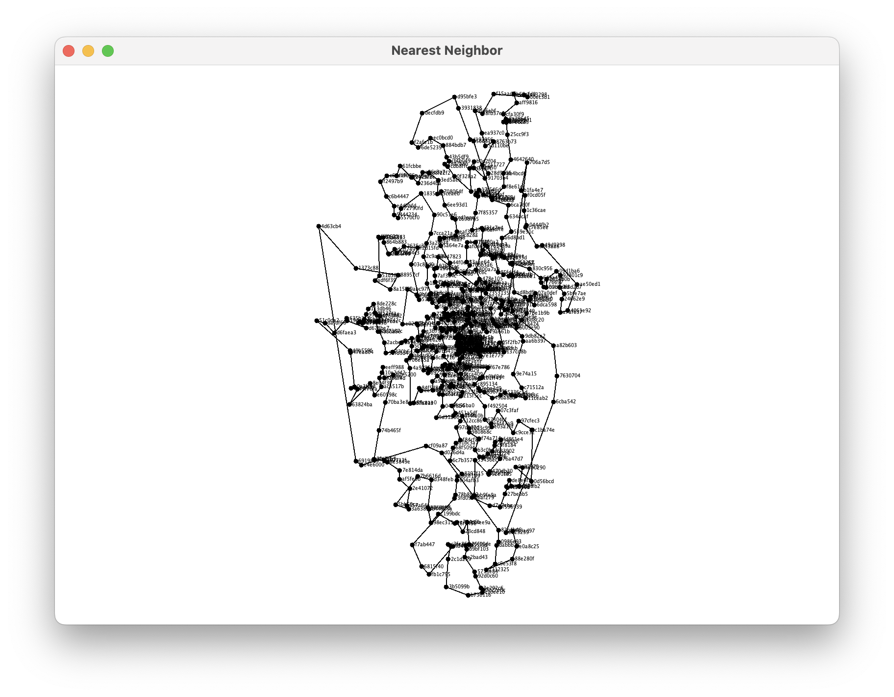

## Nearest Neighbor vs. 2-OPT

The 2-Opt algorithm optimizes the original structure while maintaining the fundamental structure.

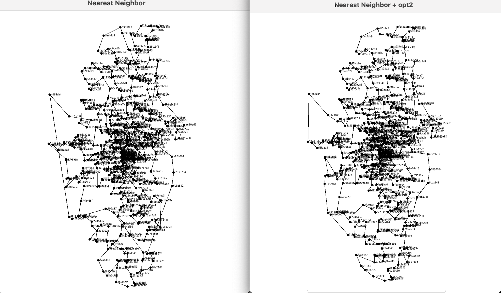

## 2-OPT vs. 3-OPT

The 3-Opt algorithm improves upon the results obtained from 2-Opt while preserving the fundamental structure.

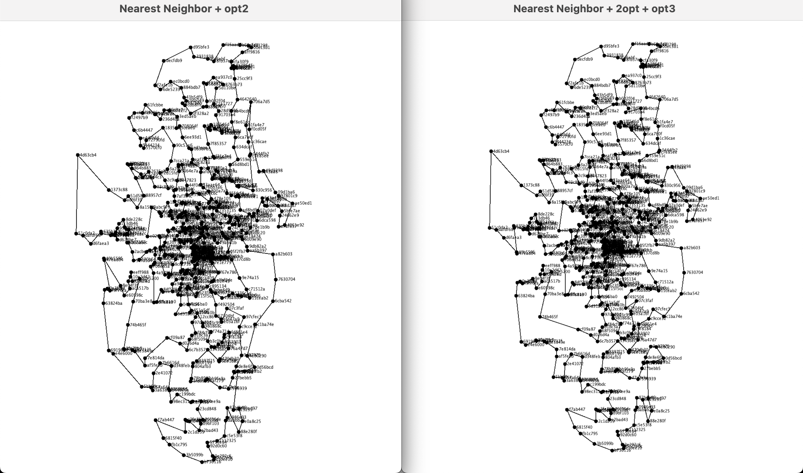

## 3-OPT vs. Simulated Annealing

Simulated annealing makes significant adjustments to the graph structure.

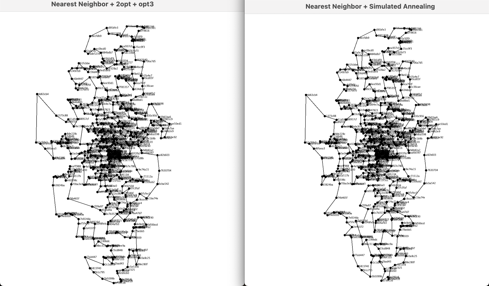

## Ant colony algorithm & optimization


Looking at the graph above, it's clear that the ACA/ACO algorithm produces a shortest path that resembles a wrapped circle around the entire graph. This is similar to how ants leave pheromone trails when they forage - the path with the most pheromones becomes the preferred route for the entire colony. As a result, the edges of the red tour have the highest pheromone value in the entire graph.

## Christofides Algorithm

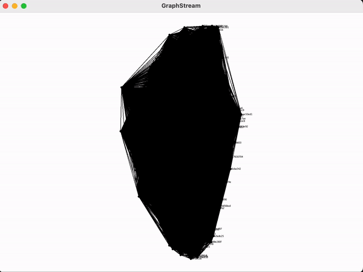

The path generated by the Christofides Algorithm can often be criss-crossed due to its transformation from an Euler circuit to a Hamilton circuit. As a result, the path length is typically longer than the optimal solution.

# Results & Mathematical Analysis

## ACA/ACO

One of the main advantages of ACO is its ability to find high-quality solutions to complex problems in a relatively short amount of time, compared to exact algorithms that can be computationally expensive for larger problem instances. Additionally, ACO is a flexible algorithm that can be adapted to different problem settings and can be easily parallelized to take advantage of modern computing resources.

However, ACO has its limitations. The algorithm can converge to suboptimal solutions when the pheromone trails lose diversity, which can be a challenge for some problem instances. Moreover, the performance of the algorithm can be affected by the choice of the algorithm parameters and the problem instance characteristics.

In ant colony optimization (ACO) algorithms, the pheromone value of each edge is typically updated based on the quality of the solutions discovered by the ants that traverse those edges.

There are various ways to calculate the pheromone value in each edge, but a common approach is to use the following formula:

$tau_{ij} = (1 - evaporation_{rate}) * tau_{ij} + \delta^{tau}_{ij}$

where:

-   $tau_{ij}$ is the current pheromone value on $edge (i, j)$
-   evaporation_rate is the rate at which pheromone evaporates over time (typically a small value between 0 and 1)
-   $\delta^{tau}_{ij}$ is the amount of pheromone deposited on $edge (i, j)$ by the ants that traverse it during the current iteration of the algorithm

The amount of pheromone deposited on an edge is typically proportional to the quality of the solution found by the ants that traversed it. For example, if the ants found a high-quality solution, then a larger amount of pheromone will be deposited on the edges they traversed.

The specific formula for calculating $\delta^{tau}_{ij}$ may vary depending on the specific problem being solved, but a common approach is to use the following formula:

$\delta^{tau}_{ij} = Q / L$

where:

-   $Q$ is a constant representing the amount of pheromone deposited by each ant per iteration
-   $L$ is the length of the path taken by the ant that traversed edge $(i, j)$

The value of $Q$ is typically set based on trial and error or domain knowledge, and the length of the path $L$ can be calculated based on the weights or costs associated with the edges and nodes in the graph.

## Christofides Algorithm

Christofides Algorithm is a well-established approach for finding near-optimal solutions to the TSP. It combines minimum spanning trees and the matching algorithms to create a solution that is guaranteed to be within 1.5 times the optimal solution, which means it can be used as the upper limit of the TSP. Although it is not guaranteed to find the exact optimal solution, it is an effective and widely-used method for solving the TSP, particularly for larger instances of the problem where exact algorithms may be too computationally expensive to apply.

# Conclusion

Based on our analysis and experimentation with various algorithms for the Traveling Salesman Problem, we conclude that the Nearest Neighbor, Greedy Heuristic, and Christofides Algorithm are effective methods for generating optimized tours.

However, after incorporating additional optimization techniques such as Ant Colony Optimization, 2-opt, 3-opt, and Simulated Annealing, we observed that the overall performance of these algorithms improved significantly. The combination of Christofides Algorithm, Ant Colony Optimization, 2-opt, 3-opt, and Simulated Annealing yielded the best result overall.

In conclusion, the Traveling Salesman Problem is a complex optimization problem, and it requires careful consideration and experimentation with various algorithms to achieve optimized results. Our analysis and results demonstrate the importance of incorporating multiple strategies and optimization techniques to generate the most effective solution.


[^1]: Gutin, G., Yeo, A., & Zverovitch, A. (2007). Exponential neighborhoods and domination analysis for the TSP. _The traveling salesman problem and its variations_, 223-256.
[^2]: Reingold, E. M., & Tarjan, R. E. (1981). On a greedy heuristic for complete matching. _SIAM Journal on Computing_, _10_(4), 676-681.
[^3]: Goodrich, M. T., & Tamassia, R. (2015). "18.1.2 The Christofides Approximation Algorithm", _Algorithm design and applications_ (Vol. 363). Hoboken: Wiley.
[^4]: Blazinskas, A., & Misevicius, A. (2011). Combining 2-opt, 3-opt and 4-opt with k-swap-kick perturbations for the traveling salesman problem. _Kaunas University of Technology, Department of Multimedia Engineering, Studentu St_, 50-401.
[^5]: Dorigo, M., & Stützle, T. (2019). _Ant colony optimization: overview and recent advances_ (pp. 311-351). Springer International Publishing.
[^6]: Bertsimas, D., & Tsitsiklis, J. (1993). Simulated annealing. Statistical science, 8(1), 10-15.
