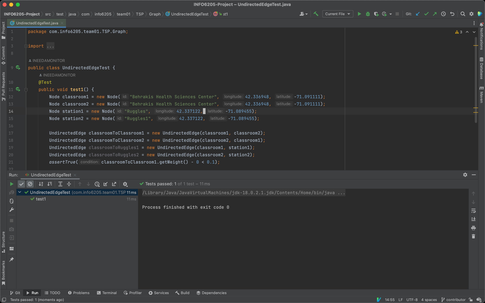
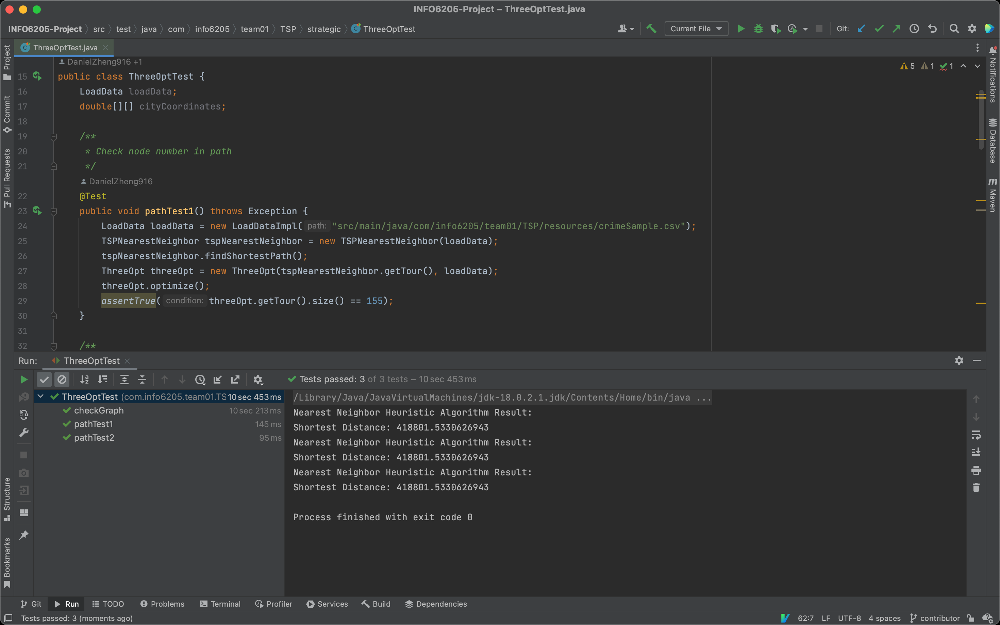
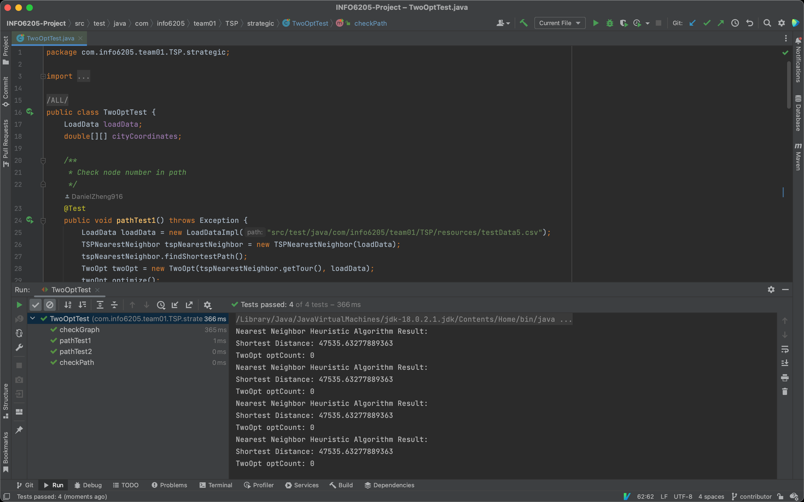
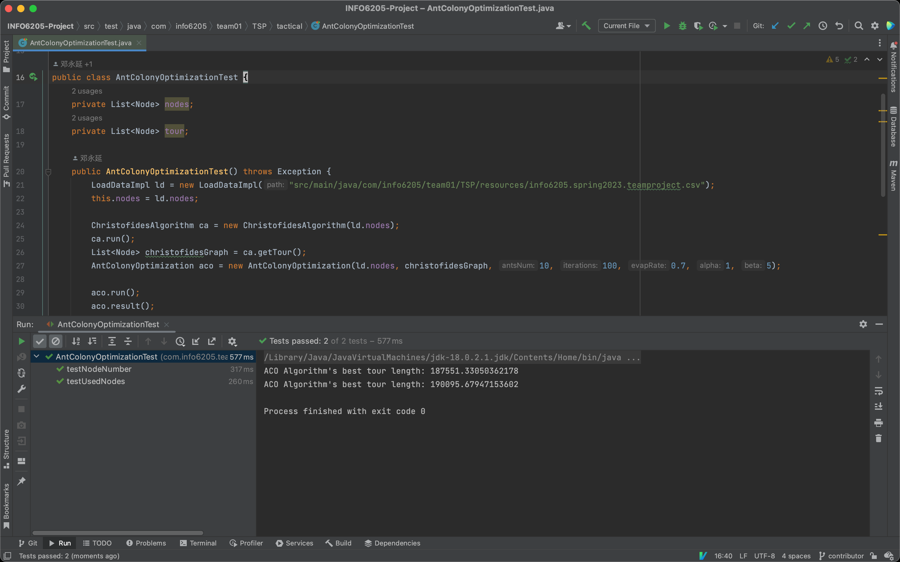
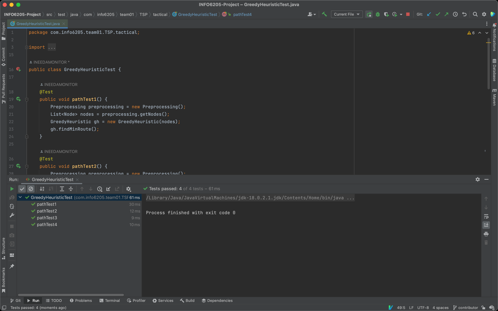
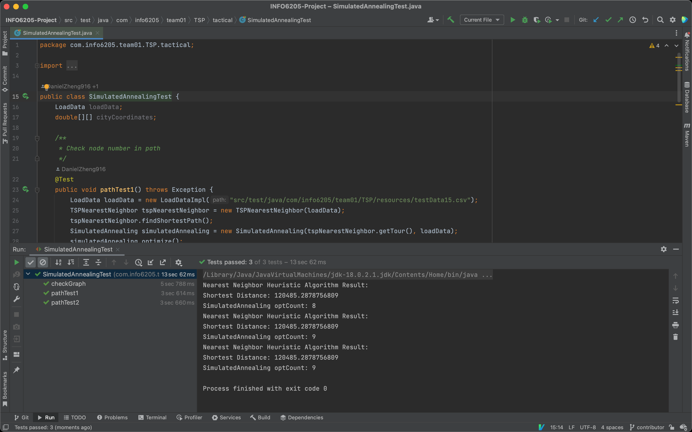
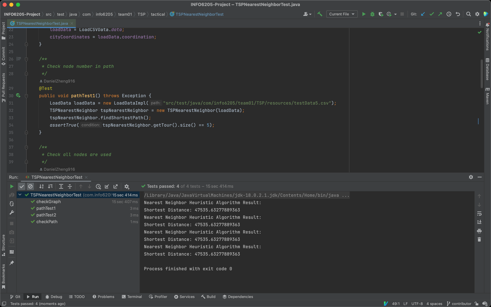

 [NodeTest.java](../src/test/java/com/info6205/team01/TSP/Graph/NodeTest.java) 

 [UndirectedEdgeTest.java](../src/test/java/com/info6205/team01/TSP/Graph/UndirectedEdgeTest.java) 

 [ThreeOptTest.java](../src/test/java/com/info6205/team01/TSP/strategic/ThreeOptTest.java) 

 [TwoOptTest.java](../src/test/java/com/info6205/team01/TSP/strategic/TwoOptTest.java) 

 [AntColonyOptimizationTest.java](../src/test/java/com/info6205/team01/TSP/tactical/AntColonyOptimizationTest.java) 

 [GreedyHeuristicTest.java](../src/test/java/com/info6205/team01/TSP/tactical/GreedyHeuristicTest.java) 

 [SimulatedAnnealingTest.java](../src/test/java/com/info6205/team01/TSP/tactical/SimulatedAnnealingTest.java) 

 [TSPNearestNeighborTest.java](../src/test/java/com/info6205/team01/TSP/tactical/TSPNearestNeighborTest.java) 

